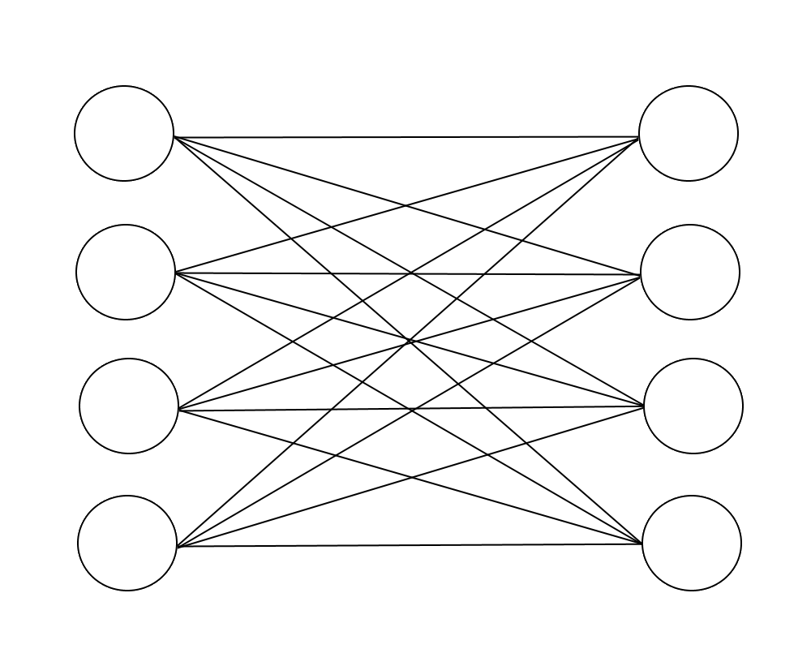
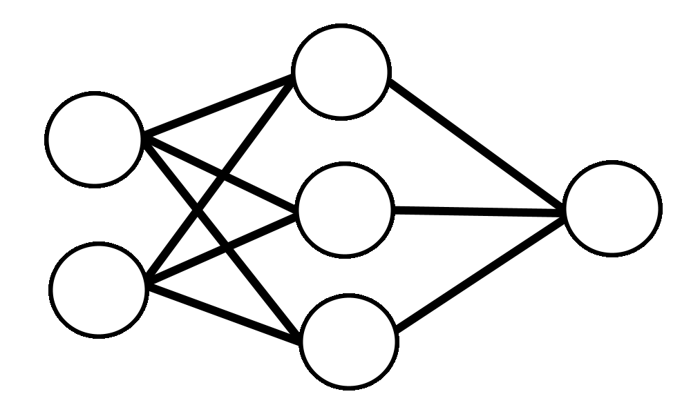

## Pre-amble (feel free to skip)

I started writing this article more than 4 years ago in 2022 but this article did not take 4 years to make. It was originally a two part article written for NUS High's Computer Science Interest Group, Appventure. However, due to various reasons such as scaling complexity, school work, dwindling motivation and many additional commitments, I never finished the second part.

The original blogpost can be found [here](https://nush.app/blog/2022/05/26/cnn-from-scratch-1/) (Please do not read, it is really bad). Over the last 4 years, I was pestered by my editor Prannaya to finish this but today I finally do it all. This is a full rewrite to make the original more clear and accessible. For the full story, on why it took so long refer to the addendum at the end. 

## Introduction

AI specifically those powered by neural networks have taken over. I setup this entire website with claude code and I almost write all my code for work with claude code. However despite its widespread use, very few people actually know how neural networks work and the math and logic behind them. Well, people actually do kind of have an idea on how it works but their understanding is opaque and it is hard to find resources online to really build it yourself. It took me many years and many sources to piece together this. I write this to fill that gap and really build it ourselves.

In this article, we build a Convolutional Neural Network from scratch with Numpy. I mean it is not exactly from scratch but it is "from scratch enough". The goal is to do it without for loops except for epoch iteration to keep the code clean. We will start with a simple example, then we with move on to an example with a simple Feed Forward Neural Network and finally we will have a full working example with a Convolutional Neural Network on the MNIST data set.
## Scope
### Autodiff
This article lives in a weird gray area. Neural networks are written in a very optimised way and some amount of agreement on how tensors are implemented is needed for it to actually be implemented well. However, I dont want to touch tensors, because it becomes harder to visualise and I am not super familiar with tensor analysis and differential geometry (I dont know at all). The moment you find a "derivative" of a matrix with respect to another matrix, it is already a mostly empty order-4 tensor (4d matrix). A convolution layer with multiple input channels and output channels has a derivative which is an even emptier order 6 tensor. It is not very useful to think about these kind of tensors for solving these kinds of problems and most college level courses stick to matrix calculus, which I think is fair. 

Furthermore, tensors really come in when you have to do forward differentiation as opposed to backward differentiation (backprop) which is what we will be doing. 

As for matrix calculus, a full deep dive into matrix calculus is not really needed for this topic, so I will first compute derivatives with summations and then I will convert them into their vector form. Thus, rules like matrix calculus chain rule and product rule need not be covered.

Perhaps one day I will write an article to tackle the various cans of worms. But to keep it scoped well, this article only requires a basic understanding of Linear Algebra, Calculus and Python.
### Universal Approximation Theorem and understanding
Why neural networks are designed in this way, or why we use convolution, or why we do this to fit functions are not in the scope of this article. Better people have talked about that topic in a better way than me in many other places. While, I did promise to go through the math, this article is focused on the calculus and not the analysis. Thus, I will not be going through UAT or the math on why things converge. As much as I would love to talk about signal processing and convolution, the scope of this article would be too large if I were to delve into those.

**What I will be going through is going from the vague understanding of what CNNs are to a real implementation of a Convolutional Neural Network on a real dataset from scratch.** Thus, all the math is covered and a full understanding of how to implement it will be gained. As mentioned earlier, I am using Numpy to keep the code clean so it is not exactly as "scratch" as possible. But by following this blogpost, you should be able to port this to any language without using any external libraries (apart from FFT or matrix multiplication or einstein summation but you can implement those as for-loops or functions fairly easily).

### AI writing disclaimer
Despite being about AI, the article is 99.9% human written. All math is hand typed in latex and all the code is hand-typed in python. The website and server is setup by AI. I also used AI to format the code a bit and fix my grammar and spelling. The code and latex, probably looks worse stylistically than anything an agent could write.
## Gradient Descent Example (Linear System Solution)

First, lets import **Numpy**.

```python
import numpy as np
```

Gradient Descent on a full neural network is a pretty daunting task so let us try Gradient Descent on a simple example. Let's start with simple simultaneous equation systems like the one below
$$
\begin{aligned}
4a+2b&=22\\
3a+8b&=49
\end{aligned}
$$
We will attempt to solve this with Gradient Descent.

If you remember, Gradient Descent is a method used to solve any sort of equation by taking steps towards the real value by using the derivative to predict the direction and size of the step. If you remember in calculus, the minimum of the graph will have a tangent of slope 0 and hence we can understand the direction of these "steps" to solve the problem. We just need a function where the derivative and function result approach 0 as you get closer to the true solution. This function is known as the objective function.

As you probably know, a linear equation is written as such:
$$
A \mathbf{x}-\mathbf{b}=0
$$
where $A$ is a known square matrix, $\mathbf{b}$ is a known vector and $\mathbf{x}$ is an unknown vector.

In this case, for the objective function we will use Linear Least Squares (LLS) function as it is an accurate thing to minimize in this case written below.
$$
F(\mathbf{x}) = {||A\mathbf{x}-\mathbf{b}||}_{2}^{2}
$$
### Multivariable Differentiation

But how exactly do we calculate the derivative of a scalar in terms of a vector? Well we have to learn some kind of multivariable calculus, but don't worry it should be all above board for the most part. Multivarible differentiation is not so bad.

Firstly, let's revise derivatives with this simple example:
$$
\begin{aligned}
y&=\sin{\left(x^2\right)}+5\\
\frac{dy}{dx}&=\frac{d}{dx}\left(\sin{\left(x^2\right)}+5\right)\\
&=2x\cos{\left(x^2\right)}
\end{aligned}
$$
For functions with multiple variables, we can find the partial derivative with respect to each of the variables, as shown below.

$$
\begin{aligned}
f(x,y)&=3xy+x^2\\
\frac{\partial f(x,y)}{\partial x}&=3y+2x\\
\frac{\partial f(x,y)}{\partial y}&=3x
\end{aligned}
$$

Basically, variables which you are not computing the derivative with respect to are treated as constants. A thing to understand is that vectors are just a collection of numbers, so an n-sized vector will have n partial derivatives if the function is $f:\mathbb{R}^{n} \rightarrow \mathbb{R}$ (the derivative is known as the gradient). We can represent the derivative like this

$$
\frac{\partial y}{\partial\mathbf{x}} = 
\begin{bmatrix}
\frac{\partial y}{\partial{\mathbf{x}}_{1}}\\
\frac{\partial y}{\partial{\mathbf{x}}_{2}}\\
\vdots\\
\frac{\partial y}{\partial{\mathbf{x}}_{n}}\\
\end{bmatrix}
$$

With an understanding of the rules above, we can see $g:\mathbb{R} \rightarrow \mathbb{R}^{n}$ and  $f:\mathbb{R}^{n} \rightarrow \mathbb{R}$ with $\mathbf{y}=g(x)$ and $z=\mathbf{f(y)}$ then
$$
\frac{\partial z}{\partial x}=\sum_{i=1}^{n} \frac{\partial z}{\partial y_{i}} \frac{\partial y_{i}}{\partial x}
$$

### Simultaneous equation

Let us start by breaking our equation down, we break it down in these two equations.
$$\mathbf{r}= \mathbf{A}\mathbf{x}$$
$$c={\left\| \mathbf{r} -\mathbf{b} \right\|}^2_2$$
This gives a good break down of the real operation and the cost function. We are trying to optimize $\mathbf{x}$ such that $\mathbf{Ax}$ is as close to $\mathbf{b}$ as possible. Writing the full matrix form of what we have, we get this for the matrix equation
$$
\begin{bmatrix}
r_{1} \\
r_{2} \\
\vdots\\
r_{n}
\end{bmatrix}=
\begin{bmatrix}
a_{11} & a_{12} & \dots & a_{1n}\\
a_{21} & a_{22} & \dots & a_{2n}\\
\vdots & \vdots & \ddots & \vdots\\
a_{n1} & a_{n2} & \dots & a_{nn}
\end{bmatrix}
\begin{bmatrix}
x_{1}\\
x_{2}\\
\vdots\\
x_{n}
\end{bmatrix}
$$
Rewriting this in terms of summations, we get these terms here
$$r_{j}=\sum_{i=1}^{n}{a_{ji}x_{i}}$$
For the cost equation, we get this
$$c=\sum_{j=1}^{n}{\left(r_{j}-b_{j}\right)^{2}}$$
Now, it is easy to calculate the partial derivatives
$$
\frac{\partial c}{\partial r_{j}}=2\left(r_{j}-b_{j}\right)
$$
$$
\frac{\partial r_{j}}{\partial x_{i}}=a_{ji}
$$
It should be easy to see the derivative in terms of summations, but because it will be useful for notation later, we will calculate the derivative first and write in terms of summation and then convert it to the vector form. The vector form also makes computation easier when we are calculating the derivatives with Numpy. The key is to calculate the derivative of $c$ with respect to the vector as opposed to a vector with respect to a vector or a vector with respect to a matrix, as this will save us from messy matrix calculus. For $\frac{\partial c}{\partial r_{j}}=2\left(r_{j}-b_{j}\right)$, we see that
$$
\frac{\partial c}{\partial \mathbf{r}}=2(\mathbf{r}-\mathbf{b})
$$
For $\frac{\partial c}{\partial x_{i}}$, we can compute like this
$$
\begin{align}
	\frac{\partial c}{\partial x_{i}}&=\sum_{j=1}^{n} \frac{\partial c}{\partial r_{j}} \frac{\partial r_{j}}{\partial x_{i}} \\
	&=\sum_{j=1}^{n} \frac{\partial c}{\partial r_{j}} a_{ji}
\end{align}
$$
From this,  we can represent it in matrices as follows
$$\frac{\partial c}{\partial \mathbf{x}}=\mathbf{A}^{T} \frac{\partial c}{\partial \mathbf{r}}$$
We see that by writing it like this computation can be done very easily as numpy (and every other BLAS library) can support matrix and vector operations clearly.

Finally, combining everything together, we get the three equations we need to solve any linear system with gradient descent.
$$
\begin{aligned}
F(\mathbf{x}) &= {||A\mathbf{x}-\mathbf{b}||}^{2} \\
\nabla F(\mathbf {x} ) &= 2 A^{T}(A\mathbf {x} -\mathbf{b}) \\
\mathbf{x}_{n+1} &= \mathbf{x}_{n}-\gamma \nabla F(\mathbf {x} _{n})
\end{aligned}
$$
where $\gamma$ is the learning rate, we need a small learning rate as it prevents the function from taking large steps and objective functions tend to overblow the "true" error of a function. 
We can now implement this in code form for a very simple linear system written below:

$$
\begin{aligned}
w+3x+2y-z=9\\
5w+2x+y-2z=4\\
x+2y+4z=24\\
w+x-y-3z=-12
\end{aligned}
$$

This can be written as such in matrix form:

$$
\begin{bmatrix}
1 & 3 & 2 & -1\\
5 & 2 & 1 & -2\\
0 & 1 & 2 & 4\\
1 & 1 & -1 & -3
\end{bmatrix}
\begin{bmatrix}
w\\
x\\
y\\
z
\end{bmatrix}
=
\begin{bmatrix}
9\\
4\\
24\\
-12
\end{bmatrix}
$$
### Code Implementation
#### Variables

$$
A=
\begin{bmatrix}
1 & 3 & 2 & -1\\
5 & 2 & 1 & -2\\
0 & 1 & 2 & 4\\
1 & 1 & -1 & -3
\end{bmatrix}
$$

```python
>>> A = np.array([[1,3,2,-1],[5,2,1,-2],[0,1,2,4],[1,1,-1,-3]], dtype=np.float64)
>>> A
array([[ 1.,  3.,  2., -1.],
       [ 5.,  2.,  1., -2.],
       [ 0.,  1.,  2.,  4.],
       [ 1.,  1., -1., -3.]])
```

$$
\mathbf{b}=
\begin{bmatrix}
9\\
4\\
24\\
-12
\end{bmatrix}
$$

```python
>>> b = np.array([[9],[4],[24],[-12]], dtype=np.float64) 
>>> b
array([[  9.],
       [  4.],
       [ 24.],
       [-12.]])
```

$$
\mathbf{x}=
\begin{bmatrix}
w\\
x\\
y\\
z
\end{bmatrix}
$$

```python
>>> x = np.random.rand(4,1)
>>> x
array([[0.09257854],
       [0.16847643],
       [0.39120624],
       [0.78484474]])
```

#### The Objective Function and its Derivative
$$
F(\mathbf{x}) = {||A\mathbf{x}-\mathbf{b}||}^{2}
$$
```python
>>> def objective_function(x):
        return np.linalg.norm(np.matmul(A,x) - b) ** 2
```
$$
\nabla F(\mathbf {x} )=2A^{T}(A\mathbf {x} -\mathbf {b})
$$
```python
>>> def objective_function_derivative(x):
        return 2 * np.matmul(A.T, np.matmul(A,x) - b)
```

In this case, I implemented an arbitrary learning rate and arbitrary step count. In traditional non-machine learning gradient descent, the learning rate changes per step and is determined via a heuristic such as the Barzilai–Borwein method, however this is not necessary as gradient descent is very robust. I used an arbitrary step count for simplicity but you should ideally use some sort of Boolean condition to break the loop such as $F(\mathbf{x})<0.01$.

$$
\mathbf {x}_{n+1}=\mathbf {x}_{n}-\gamma \nabla F(\mathbf {x} _{n})
$$

```python
>>> learning_rate = 0.01
>>> for i in range(5000):
        x -= learning_rate * objective_function_derivative(x)
>>> x
array([[1.],
       [2.],
       [3.],
       [4.]])
```

And to check, we now use a simple matrix multiplication:

```python
>>> np.matmul(A,x)
array([[  9.],
       [  4.],
       [ 24.],
       [-12.]])
```

Voila, we have solved the equation with gradient descent, and the solution is super close. This shows the power of gradient descent.
## Deep Neural Network Math
Before we jump to full Convolutional Neural Networks, lets start with a simple deep neural network.
### Forward Step
The deep neural network case is not so different from our original simple linear system example, we just have to calculate a few for more things. The essence of each neural network is layer is also multiplying the values of  a prior layer with a matrix and getting a new weight.

The equation for a single inactivated layer is as follows
$$
\mathbf{z}=\mathbf{W}\mathbf{a}+\mathbf{b}
$$
$$
\begin{bmatrix}
z_{1} \\
z_{2} \\
\vdots\\
z_{m}
\end{bmatrix}=
\begin{bmatrix}
w_{11} & w_{12} & \dots & w_{1n}\\
w_{21} & w_{22} & \dots & w_{2n}\\
\vdots & \vdots & \ddots & \vdots\\
w_{m1} & w_{m2} & \dots & w_{mn}
\end{bmatrix}
\begin{bmatrix}
a_{1}\\
a_{2}\\
\vdots\\
a_{n}
\end{bmatrix}
+
\begin{bmatrix}
b_{1}\\
b_{2}\\
\vdots\\
b_{m}
\end{bmatrix}
$$
where $\mathbf{a}$ is the previous layers values, $\mathbf{W}$ is the weight matrix, $\mathbf{b}$ is the bias vector and $\mathbf{z}$ is the inactivated layer. We see that this part is not much different from the example earlier. There is also an element wise non polynomial activation function added afterwards. By and large, the Relu function is used here, but before that people used the sigmoid activation function. Either way, it is an element activation function and it is computed as follows
$$
\mathbf{a'}=\sigma\left(\mathbf{z}\right)
$$
$$
\begin{bmatrix}
a'_{1} \\
a'_{2} \\
\vdots\\
a'_{m}
\end{bmatrix}=
\begin{bmatrix}
\sigma \left(a_{1}\right)\\
\sigma \left(a_{2}\right)\\
\vdots\\
\sigma \left(a_{n}\right)
\end{bmatrix}
$$
This gives us the full neural network layer. We can also use the same mean square error,as the loss function, thus we can now right the full neural network in terms of vectors and matrices
$$\mathbf{a}^{(0)}=\mathbf{x}$$
$$\mathbf{z}^{(l)}=\mathbf{W}^{(l)}\mathbf{a}^{(l-1)}+\mathbf{b}^{(l)}$$
$$\mathbf{a}^{(l)}=\sigma \left(\mathbf{z}^{(l)} \right)$$
where $l=1,2,3,\dots,L$ for the different layers from the neural network and $\mathbf{x}$ is the input, everything else is layer specific. For the final layer $\mathbf{a}^{(L)}$, we can compare it against the true output $\mathbf{y}$ to get the cost $c$
$$\mathbf{c}=\frac{1}{n}{\left\| \mathbf{a}^{(L)} -\mathbf{y} \right\|}^2_2$$
### Backward - Last layer
First, we calculate the derivative of the cost with respect to the previous layer. With indices, it looks like this
$$c=\frac{1}{n}\sum_{i=1}^{n}{\left(a^{(L)}_{i}-y_i\right)^{2}}$$
This is the same as earlier, it is just divided by n, this prevents the gradient being too high when the number of perceptrons in the last layer is high. The derivative is straightforwardly
$$
\frac{\partial c}{\partial a^{(L)}_{i}}=\frac{2}{n}\left(a^{(L)}_{i}-y_{i}\right)
$$
It should be quite easy to see that the vector form of this is
$$
\frac{\partial c}{\partial \mathbf{a}^{(L)}}=\frac{2}{n}\left(\mathbf{a}^{(L)}-\mathbf{y}\right)
$$
### Backward - Unactivated layer
For the activation, it is done element-wise, so the index notation, just looks like this
$$a^{(l)}_{i}=\sigma \left(z^{(l)}_{i}\right)$$
The derivative is just the straightforward
$$\frac{\partial a^{(l)}_i}{\partial z^{(l)}_i}=\sigma'\left(z^{(l)}_{i}\right)$$
Now computing with respect to c, we can calculate with the sum and the pre-existing derivative from the prior layer.
$$
\begin{align}
	\frac{\partial c}{\partial z^{(l)}_i}&=\sum_{j=1}^{n}{\frac{\partial c}{\partial a^{(l)}_{j}}\frac{\partial a^{(l)}_j}{\partial z^{(l)}_i}} \\
	&=\frac{\partial c}{\partial a^{(l)}_{i}}\frac{\partial a^{(l)}_i}{\partial z^{(l)}_i} \\
	&=\frac{\partial c}{\partial a^{(l)}_{i}}\sigma'\left(z^{(l)}_{i}\right)
\end{align}
$$
This is similar to the step we did earlier with the standard linear algebra case. To write this out in vector form this is just an element wise multiply, not a traditional linear algebra operation. In Numpy this is the standard $*$ multiply operator, I think in most ML papers, they use the $\odot$ symbol. Thus, it is written like this in vector form.
$$
\frac{\partial c}{\partial \mathbf{z}^{(l)}}=\frac{\partial c}{\partial \mathbf{a}^{(l)}}\odot \sigma'\left(\mathbf{z}^{(l)}\right)
$$
### Backward - Bias
Looking at the equation
$$\mathbf{z}^{(l)}=\mathbf{W}^{(l)}\mathbf{a}^{(l-1)}+\mathbf{b}^{(l)}$$
We see that bias undergoes no transformation and is not multiplied with anything. Thus,
$$
\frac{\partial c}{\partial \mathbf{b}^{(l)}}=\frac{\partial c}{\partial \mathbf{z}^{(l)}}
$$
### Backward - Weight
From the equation earlier the form in indices is
$$z^{(l)}_{i}=b^{(l)}_i+\sum_{i=1}^{n}w^{(l)}_{ij}a^{(l-1)}_{j}$$
From this, we can clearly see
$$\frac{\partial z^{(l)}_{i}}{\partial w^{(l)}_{ij}}=a^{(l-1)}_{j}$$
Calculating the derivative across another variable, we see that 
$$
\begin{align}
	\frac{\partial c}{\partial w^{(l)}_{ij}}&=\sum_{k=1}^{m}{\frac{\partial c}{\partial z^{(l)}_{k}}\frac{\partial z^{(l)}_k}{\partial w^{(l)}_{ij}}} \\
	&=\frac{\partial c}{\partial z^{(l)}_{i}}\frac{\partial z^{(l)}_i}{\partial w^{(l)}_{ij}} \\
	&=\frac{\partial c}{\partial z^{(l)}_{i}}a^{(l-1)}_{j}
\end{align}
$$
In this step, we have to be careful with writing the indices, this is not the same as an element wise operation, the index for $\frac{\partial c}{\partial\mathbf{z}^{(l)}}$ is $i$ and the index for $\mathbf{a}^{(l-1)}$ is $j$. We can actually express this as a product of a vertical and horizontal vector
$$
\begin{align}
    \frac{\partial c}{\partial \mathbf{W}}&=
	\begin{bmatrix}
	\frac{\partial c}{\partial w^{(l)}_{11}} & \frac{\partial c}{\partial w^{(l)}_{12}} & \dots & \frac{\partial c}{\partial w^{(l)}_{1n}}\\
	\frac{\partial c}{\partial w^{(l)}_{21}} & \frac{\partial c}{\partial w^{(l)}_{22}} & \dots & \frac{\partial c}{\partial w^{(l)}_{2n}}\\
	\vdots & \vdots & \ddots &\vdots\\
	\frac{\partial c}{\partial w^{(l)}_{m1}} & \frac{\partial c}{\partial w^{(l)}_{m2}} & \dots & \frac{\partial c}{\partial w^{(l)}_{mn}}
	\end{bmatrix} \\
	&=\begin{bmatrix}
	\frac{\partial c}{\partial z^{(l)}_{1}} a^{(l-1)}_{1} & \frac{\partial c}{\partial z^{(l)}_{1}} a^{(l-1)}_{2} & \dots & \frac{\partial c}{\partial z^{(l)}_{1}} a^{(l-1)}_{n}\\
	\frac{\partial c}{\partial z^{(l)}_{2}} a^{(l-1)}_{1} & \frac{\partial c}{\partial z^{(2)}_{2}} a^{(l-1)}_{2} & \dots & \frac{\partial c}{\partial z^{(l)}_{2}} a^{(l-1)}_{n} \\
	\vdots & \vdots & \ddots &\vdots\\
	\frac{\partial c}{\partial z^{(l)}_{m}} a^{(l-1)}_{1} & \frac{\partial c}{\partial z^{(l)}_{m}} a^{(l-1)}_{2} & \dots & \frac{\partial c}{\partial z^{(l)}_{m}} a^{(l-1)}_{n}
	\end{bmatrix} \\
	&=\begin{bmatrix}
		\frac{\partial c}{\partial z^{(l)}_{1}} \\
		\frac{\partial c}{\partial z^{(l)}_{2}} \\
		\vdots \\
		\frac{\partial c}{\partial z^{(l)}_{2}}
	\end{bmatrix}
	\begin{bmatrix}
		a^{(l-1)}_{1} & a^{(l-1)}_{2} & \dots & a^{(l-1)}_{n}
	\end{bmatrix} \\
	&=\frac{\partial c}{\partial \mathbf{z}^{(l)}}{\mathbf{a}^{(l-1)}}^T
\end{align}
$$
### Backward - Prior Layer
Similar to the linear algebra example,
$$\frac{\partial z^{(l)}_{i}}{\partial a^{(l-1)}_{j}}=w^{(l)}_{ij}$$
It follows from earlier, that
$$
\begin{align}
	\frac{\partial c}{\partial a^{(l-1)}_i}&=\sum_{j=1}^{n}{\frac{\partial c}{\partial z^{(l)}_{j}}\frac{\partial z^{(l)}_j}{\partial a^{(l-1)}_i}} \\
	&=\sum_{j=1}^{n}{\frac{\partial c}{\partial z^{(l)}_{j}}w^{(l)}_{{ji}}}
\end{align}
$$
and
$$
\frac{\partial c}{\partial \mathbf{a}^{(l-1)}}={\mathbf{W}^{(l)}}^T\frac{\partial c}{\partial \mathbf{z}^{(l)}}
$$
### Backward step
Finally, we have a full picture of what the steps look like
$$
\frac{\partial c}{\partial \mathbf{a}^{(L)}}=\frac{2}{n}\left(\mathbf{a}^{(L)}-\mathbf{y}\right)
$$
$$
\frac{\partial c}{\partial \mathbf{z}^{(l)}}=\frac{\partial c}{\partial \mathbf{a}^{(l)}}\odot \sigma'\left(\mathbf{z}^{(l)}\right)
$$
$$
\frac{\partial c}{\partial \mathbf{b}^{(l)}}=\frac{\partial c}{\partial \mathbf{z}^{(l)}}
$$
$$
\frac{\partial c}{\partial \mathbf{a}^{(l-1)}}={\mathbf{W}^{(l)}}^T\frac{\partial c}{\partial \mathbf{z}^{(l)}}
$$
$$
\frac{\partial c}{\partial \mathbf{W}^{(l)}}=\frac{\partial c}{\partial \mathbf{z}^{(l)}}{\mathbf{a}^{(l-1)}}^T
$$
Now, we can start to implement the neural network with code
## Neural Network Implementation (XNOR Gate)

To test out a neural network, we are gonna test it out  on a small dataset, 

| **Input** |     |  **Output**  |
| :---: | :-: | :------: |
|   **A**   |  **B**  | **A XNOR B** |
|   0   |  0  |    1     |
|   0   |  1  |    0     |
|   1   |  0  |    0     |
|   1   |  1  |    1     |

For those who do not know, the XNOR gates inputs and outputs are written above. It is pretty suitable for this example, because the inputs and outputs are all 0 and 1, hence it is fast to train and there is no bias in the data.

For this example, we aren't going to do train-test split as the objective is to show that a neural network can fit functions.

From here, let's try coding out the (x,y) pairs in NumPy:

```python
data = [[np.array([[0],[0]], dtype=np.float64),np.array([[1]], dtype=np.float64)],
        [np.array([[0],[1]], dtype=np.float64),np.array([[0]], dtype=np.float64)],
        [np.array([[1],[0]], dtype=np.float64),np.array([[0]], dtype=np.float64)],
        [np.array([[1],[1]], dtype=np.float64),np.array([[1]], dtype=np.float64)]]
```

We then define a network structure. It doesn't have to be too complex because it is a pretty simple function. I decided on a $2 \rightarrow 3 \rightarrow 1$ multi-layer perceptron (MLP) structure, with the sigmoid activation function.



First, we start by defining our variables, for the sake of thinking of column vectors as columns, I will encode them as 2d vectors

```python
class NNdata:
    def __init__(self):
        self.a_0 = None
        self.W_1 = np.random.rand(3, 2)
        self.b_1 = np.random.rand(3, 1)
        self.z_1 = None
        self.a_1 = None
        self.W_2 = np.random.rand(1, 3)
        self.b_2 = np.random.rand(1, 1)
        self.z_2 = None
        self.a_2 = None
        self.db_2 = None
        self.dw_2 = None
        self.db_1 = None
        self.dw_1 = None
```

We then write out our activation function, which is sigmoid. Sigmoid is a fairly simple activation function, it is an increasing function that sends $\mathbb{R}$ to $(0,1)$ . It is defined as $\sigma(x)=\frac{1}{1+e^{-x}}$ and its derivative is defined as $\sigma'(x)=\sigma (x) (1-\sigma (x))$. The loss function we will stick with for now is MSE loss as we defined earlier.

```python
    def sigmoid(self, value):
        return 1 / (1 + np.exp(-value))

    def sigmoid_derivative(self, value):
        sigmoid_value = self.sigmoid(value)
        return sigmoid_value * (1 - sigmoid_value)
    
    def loss(self, target):
        return np.linalg.norm(self.a_2 - target) ** 2
```

For our feed forward, we do a very simple network
$$
\mathbf{a}^{(0)}=x
$$
$$\mathbf{z}^{(1)}=\mathbf{W}^{(1)}\mathbf{a}^{(0)}+\mathbf{b}^{(1)}$$
$$\mathbf{a}^{(1)}=\sigma \left(\mathbf{z}^{(1)}\right)$$
$$\mathbf{z}^{(2)}=\mathbf{W}^{(2)}\mathbf{a}^{(1)}+\mathbf{b}^{(2)}$$
$$\mathbf{a}^{(2)}=\sigma \left(\mathbf{z}^{(2)}\right)$$
As you can see it is pretty one to one with the math

```python
    def feed_forward(self, features):
        self.a_0 = features

        self.z_1 = np.matmul(self.W_1, self.a_0) + self.b_1
        self.a_1 = self.sigmoid(self.z_1)

        self.z_2 = np.matmul(self.W_2, self.a_1) + self.b_2
        self.a_2 = self.sigmoid(self.z_2)
        return self.a_2
```

The backprop math for layer 2 looks like this
$$\frac{\partial c}{\partial \mathbf{z}^{(2)}}=2(\mathbf{a}^{(2)}-\mathbf{y})\odot\sigma'\left(\mathbf{z}^{(2)}\right)$$
$$
\frac{\partial c}{\partial \mathbf{b}^{(2)}}=\frac{\partial c}{\partial \mathbf{z}^{(2)}}
$$
$$\frac{\partial c}{\partial \mathbf{W}^{(2)}} = \frac{\partial c}{\partial \mathbf{z}^{(2)}}{\mathbf{a}^{(1)}}^T$$
And the backprop math for layer 1 looks like this
$$\frac{\partial c}{\partial \mathbf{a}^{(1)}} = {\mathbf{W}^{(2)}}^T\frac{\partial c}{\partial \mathbf{z}^{(2)}}$$
$$\frac{\partial c}{\partial \mathbf{z}^{(1)}}=\frac{\partial c}{\partial \mathbf{a}^{(1)}} \odot\sigma'\left(\mathbf{z}^{1)}\right)$$
$$
\frac{\partial c}{\partial \mathbf{b}^{(1)}}=\frac{\partial c}{\partial \mathbf{z}^{(1)}}
$$
$$\frac{\partial c}{\partial \mathbf{W}^{(1)}} = \frac{\partial c}{\partial \mathbf{z}^{(1)}}{\mathbf{a}^{(0)}}^T$$
Once again, it is almost one to one with the code

```python
    def back_prop(self, target):
        dcdz_2 = 2 * self.sigmoid_derivative(self.z_2) * (self.a_2 - target)
        dcdb_2 = dcdz_2
        dcdw_2 = np.matmul(dcdz_2, self.a_1.T)

        dcda_1 = np.matmul(self.W_2.T, dcdz_2)
        dcdz_1 = self.sigmoid_derivative(self.z_1) * dcda_1
        dcdb_1 = dcdz_1
        dcdw_1 = np.matmul(dcdz_1, self.a_0.T)

        self.db_2 = dcdb_2
        self.dw_2 = dcdw_2
        self.db_1 = dcdb_1
        self.dw_1 = dcdw_1
```

Next I program gradient descent. There are 3 kinds of gradient descent when there are multiple datapoints, Stochastic, Batch and Mini-Batch. In Stochastic Gradient Descent (SGD), the weights are updated after a single sample is run. This will obviously cause your step towards the ideal value be very chaotic. In Batch Gradient Descent, the weights are updated after every sample is run, and the net step is the sum/average of all the $\nabla F(x)$, which is less chaotic, but steps are less frequent.

Of course, in real life, we can never know which algorithm is better without making an assumption about the data. (No Free Lunch Theorem) A good compromise is Mini-Batch Gradient Descent, which is like Batch Gradient Descent but use smaller chunks of all the datapoints every step. In this case, I use Batch Gradient Descent because it is only like 4 tests

```python
nndata = NNdata()
learning_rate = 0.1
for i in range(10000):
    db_1_batch = []
    dw_1_batch = []
    db_0_batch = []
    dw_0_batch = []
    c = []
    for j in range(4):
        nndata.feed_forward(data[j][0])
        c.append(nndata.loss(data[j][1]))
        nndata.back_prop(data[j][1])
        db_1_batch.append(nndata.db_1)
        dw_1_batch.append(nndata.dw_1)
        db_0_batch.append(nndata.db_0)
        dw_0_batch.append(nndata.dw_0)
    if((i+1) % 1000 == 0):
        print("loss (%d/10000): %.3f" % (i+1, sum(c)/4))
    nndata.b_1 -= learning_rate * sum(db_1_batch)
    nndata.W_1 -= learning_rate * sum(dw_1_batch)
    nndata.b_0 -= learning_rate * sum(db_0_batch)
    nndata.W_0 -= learning_rate * sum(dw_0_batch)
```

Output resource:

```
loss (1000/10000): 0.194
loss (2000/10000): 0.029
loss (3000/10000): 0.007
loss (4000/10000): 0.004
loss (5000/10000): 0.002
loss (6000/10000): 0.002
loss (7000/10000): 0.001
loss (8000/10000): 0.001
loss (9000/10000): 0.001
loss (10000/10000): 0.001
```

Voila! We have officially programmed Neural Networks from scratch. Pat yourself on the back for reading through this. And of course, if you bothered to code this out, try porting it over to different languages like Java, JS or even C (yikes why would [anyone](https://github.com/terminalai/neuralC) subjects themselves to that?). Now it is time for the real kicker, Convolutional Neural Networks, where the math and code is a bit more trickier
## Convolution
### 1D Convolution
Mathematical convolution is defined as 
$$
(f*g)(t):=\int _{-\infty }^{\infty }f(\tau )g(t-\tau )\,d\tau
$$
While, this may look complicated and it is, we do not really have to grasp this equation in particular to understand convolution as we are working with in the discrete case. In the discrete case for two 1D lists, convolution look something like this
$$
(f*g)[n]=\sum f[k]g[n-k]
$$
You may understand it as a form of sliding window multiplication. For example, if you have a list like $\left[1,2,3,4,5\right]$ and you want to convolve it with a kernel like this $[6,7,8]$. You first take the kernel and flip it to get $\left[8,7,6\right]$. Then, you multiply the first 3 in the list with the 3 values in the kernel pointwise and sum it up, kind of like a dot product so $1*8+2*7+3*6=40$. Then, you shift the kernel "forward" and multiply it by the 2nd to 4th value. So you get $2*8+3*7+4*6=61$. Do this more times (for this example, one more time) until the end of the kernel matches the end of the list. Then, the output of this operation would be $[40,61,82]$.
### Caveats
#### Flipping the kernel
In normal Fourier analysis, the kernel is flipped or applied in reverse as you see in the equations above. It was defined like this for reasons that will become obvious later in the article. However, when first learning about convolution in machine learning people often don't flip the kernel. Flipped or not, it doesn't make much difference as the kernel is what is trained in a convolutional neural net. For the math in the next section and for the rest of the article, I will just treat the kernel as unflipped unless it is relevant to the part.
#### Padding and stride
For this article, we just treat convolution as having no padding and a stride of 1. Padding refers to if you want to add 0's to the ends of your list such that the input list matches the length of the output list. So, for the example above, we would be convolving $\left[0,0,1,2,3,4,5,0,0\right]$ with $\left[6,7,8\right]$ to produce the output $\left[6,19,40,61,82,59,40\right]$. Stride refers to how much you shift the kernel by. For the example above, we were shifting the kernel by 1 each time. if,  we were to have a stride of two, the output of the above example would be $[40,82]$. Adapting the code to account for stride and padding should not be too difficult.
### 2D convolution
In two dimensions, it is the same as one dimension just shifted up and down accordingly so

$$
\begin{bmatrix}
1 & 2 & 3\\
4 & 5 & 6\\
7 & 8  & 9
\end{bmatrix}*
\begin{bmatrix}
1 & 1\\
0 & 0\\
\end{bmatrix}
=
\begin{bmatrix}
3 & 5\\
9 & 11\\
\end{bmatrix}
$$

Convolution was used before neural networks as a signal processing technique. The equation in terms of summation looks like this for an $n\times m$ matrix $\mathbf{X}$ and a $k_{1}\times k_{2}$ kernel $\mathbf{W}$. For the equation $\mathbf{A}=\mathbf{X}*\mathbf{W}$, the summation equation looks like this 
$$a_{i,j}=\sum_{p=1}^{k_{1}}\sum_{q=1}^{k_{2}}x_{i+p-1,j+q-1}w_{p,q}$$
Why exactly Convolution is used for image processing is, a key thing to understand though is that the computation for 2D convolution, is fairly expensive. For an $N\times N$ matrix with a $k\times k$ sized kernel, the time complexity would be something like $O(N^{2}k^{2})$. There, is also an expected amount of $C_{in}$ input and $C_{out}$ output channels, for which there is one kernel for each. Thus, the time complexity with an input and output channels is $O(C_{in}C_{out}N^{2}k^{2})$. Luckily, there is a speedup that we can do to make things faster with Fast Fourier Transform (FFT).
### Convolution - Fourier Transform duality
#### The Fourier Transform
The Fourier Transform is probably the most important transformation of all time. Fourier Transform is defined as 
$$
\widehat{f}\left(\xi  \right)=\int_{-\infty}^{\infty}f(x)e^{-i 2\pi \xi x} dx
$$
The Fourier transforms takes functions and describes them as their frequencies. From looking at the equation, you can kind of see why that is. $e^{-i 2 \pi \xi x}$ is a wave, and whenever $f(x)$ is a wave, that matches the frequency at a given frequency $\xi$, the waves cancel out and the integral becomes $\int_{-\infty}^{\infty}1dx$ which leads to their being an infinite pulse. Thus, a function like $\sin{(x)}$ is flat everywhere except two points, where it pulses infinitely. For, functions, that are not waves that are made up of a band of frequencies, the resulting Fourier Transform wont look as clean. This is a rather crude and a somewhat not exact explanation but its importance is far-reaching and out of scope for this article. The Fourier transform has an inverse as well that converts a transformed function back to the original function. It is defined as
$$
f\left(x  \right)=\int_{-\infty}^{\infty}\widehat{f}(\xi)e^{i 2\pi \xi x} d\xi
$$
#### Discrete Fourier Transform and Fast Fourier Transform
Much like convolution, the Fourier Transform has a discrete variation defined as follows
$$X_{k}=\sum _{n=0}^{N-1}x_{n}\cdot e^{-i2\pi {\tfrac {k}{N}}n}$$
With the inverse defined as
$$
x_{n}={\frac {1}{N}}\sum _{k=0}^{N-1}X_{k}\cdot e^{i2\pi {\tfrac {k}{N}}n}
$$
Implementing, such an equation naively would be $O(N^2)$. However, a faster implementation of this exists, known as Fast Fourier Transform (FFT) which can compute this in $O(N\log {N})$. I assume most reading  this (and most people) as well have probably heard about FFT.  But many don't know about the relationship between FFT and Convolution.
#### Convolution-Fourier Transform duality
The Fourier Transform and Convolution have a special relationship that make the computation of convolution much faster. The relationship being that multiplication in the spectral domain is the same as convolution the spatial domain which is to say that 
$$\widehat{f*g}=\skew{2.9}\widehat{f\vphantom{h}} \space\skew{1.2}\widehat{g\vphantom{h}}$$
Seeing this is not so hard, setting $z=x+y$
$$
\begin{align}
\skew{2.9}\widehat{f\vphantom{h}} (\xi) \space\skew{1.2}\widehat{g\vphantom{h}} (\xi)&=\int_{-\infty}^{\infty}f(x)e^{-i 2\pi \xi x} dx\int_{-\infty}^{\infty}g(y)e^{-i 2\pi \xi y} dy  \\
&=\int_{-\infty}^{\infty}\int_{-\infty}^{\infty} f(x)g(y)e^{-i 2\pi \xi (x+y)}dxdy \\
&=\int_{-\infty}^{\infty}\int_{-\infty}^{\infty} f(x)g(z-x) dx \space e^{-i 2\pi \xi z}dz \\
&= \int_{-\infty}^{\infty} (f*g)(z) \space e^{-i 2\pi \xi z}dz \\
&= (\widehat{f*g}) (\xi)
\end{align}
$$
In the discrete case, point-wise multiplication of two lists that have undergone Fourier transform is convolution of the two lists.
#### 2D Discrete Fourier Transform
For 2D, the Discrete Fourier Transform is defined as
$$
\widehat{x}_{lm}=\sum_{j=1}^{N}\sum_{k=1}^{M}x_{jk}e^{-2\pi i \left( \frac{(j-1)l}{N} + \frac{(k-1)m}{M} \right) }
$$
The inverse is defined as
$$
x_{jk}=\frac{1}{NM} \sum_{j=1}^{N}\sum_{k=1}^{M} \widehat{x}_{lm}e^{2\pi i \left( \frac{(j-1)l}{N} + \frac{(k-1)m}{M} \right) }
$$
Using similar logic as earlier, we can see that 2D convolution is also related to Fourier transform. We will take the convolution of a $N$ by $M$ matrix $\mathbf{X}$ and a $k_{1}$ by $k_{2}$ kernel matrix $\mathbf{W}$ with $k_{1}\leq N$ and $k_{2}\leq M$. Define $\mathbf{Y}$ as $N$ by $M$ matrix. Where the submatrix $\mathbf{Y}_{i\leq k_{1},j \leq k_{2}}$ is the "flipped" version of $\mathbf{W}$ and the rest of the values are zeros. In this case, flip is not a transpose but rather a reverse in both dimensions, equivalent to like `matrix[::-1,::-1]` in Numpy or sending $i,j\rightarrow k_{1}-i+1,k_{2}-j+1$. Thus, the dimension of the matrix doesnt change or swap like a transpose. Using this, taking the pointwise multiplication of the Fourier Transform of $\mathbf{X}$ and $\mathbf{Y}$, we get
$$
\begin{align}
\widehat{x}_{l,m}\skew{1.2}\widehat{y}_{l,m}&=\sum_{j=1}^{N}\sum_{k=1}^{M}x_{j,k}e^{-2\pi i \left( \frac{(j-1)l}{N} + \frac{(k-1)m}{M} \right) }\sum_{p=1}^{N}\sum_{q=1}^{M}y_{p,q}e^{-2\pi i \left( \frac{(p-1)l}{N} + \frac{(q-1)m}{M} \right) } \\
&=\sum_{j=1}^{N}\sum_{k=1}^{M}\sum_{p=1}^{N}\sum_{q=1}^{M}x_{j,k}y_{p,q}e^{-2\pi i \left( \frac{(j+p-1-1)l}{N} + \frac{(k+q-1-1)m}{M} \right) } \\
&=\sum_{\tau=1}^{N}\sum_{\upsilon=1}^{M}\sum_{p=1}^{N}\sum_{q=1}^{M}x_{\tau-p+1,\upsilon-q+1}y_{p,q}e^{-2\pi i \left( \frac{(\tau-1)l}{N} + \frac{(\upsilon-1)m}{M} \right) } \\
&=\sum_{\tau=1}^{N}\sum_{\upsilon=1}^{M} \left ( \sum_{p=1}^{N}\sum_{q=1}^{M}x_{\tau-p+1,\upsilon-q+1}y_{p,q} \right) e^{-2\pi i \left( \frac{(\tau-1)l}{N} + \frac{(\upsilon-1)m}{M} \right) } \\
&=\sum_{\tau=1}^{N}\sum_{\upsilon=1}^{M} \left ( \sum_{p=1}^{k_{1}}\sum_{q=1}^{k_{2}}x_{\tau+k_{1}-p+1-1,\upsilon+k_{2}-q+1-1}y_{k_{1}-p+1,k_{2}-q+1} \right) e^{-2\pi i \left( \frac{(\tau-1)l}{N} + \frac{(\upsilon-1)m}{M} \right) } \\
&=\sum_{\tau=1}^{N}\sum_{\upsilon=1}^{M} \left ( \sum_{r=1}^{k_{1}}\sum_{s=1}^{k_{2}}x_{\tau+r-1,\upsilon+s-1}w_{r,s} \right) e^{-2\pi i \left( \frac{(\tau-1)l}{N} + \frac{(\upsilon-1)m}{M} \right) } \\
&=\sum_{\tau=1}^{N}\sum_{\upsilon=1}^{M} \left [ \mathbf{X} * \mathbf{W}\right]_{\tau,  \upsilon} e^{-2\pi i \left( \frac{(\tau-1)l}{N} + \frac{(\upsilon-1)m}{M} \right) } \\
&=\left [ \widehat{\mathbf{X} * \mathbf{W}}\right]_{l,m}
\end{align}
$$
This may look strange because of some of the negative indexing in the middle, but that is actually circular indexing, so if it is 0, it is actually the last value and so on. I will not elaborate further, this was very annoying (and some would say unnecessary) to type.

This speed up allows us to speed convolution up from $O(C_{in}C_{out}N^{2}k^{2})$ to $O(C_{in}C_{out}N^{2}\log {N})$. Which is great, I guess!
### Convolution (Single Channel)
For Convolution and Max Pooling, the actual implementation of each step is not as straight forward as with the normal feed-forward Neural Networks. So, I will go through a mix of math and code. However, the code for a single layer of Convolution is not so bad. We will be using Numpy's FFT Library as it is pretty good.

```python
from numpy.fft import fft2, ifft2
```


```python
def conv2d(input_array, kernel):
    input_transformed = fft2(input_array)
    kernel_transformed = fft2(kernel[::-1, ::-1], input_array.shape)
    output_transformed = input_transformed * kernel_transformed
    output_full = np.real(ifft2(output_transformed))
    crop_start = kernel.shape[0] - 1
    return output_full[crop_start:, crop_start:]
```

### Convolution (Multi Channel)


```python
def conv2d(input_array, kernel_weights):
    input_transformed = fft2(input_array)
    kernel_transformed = fft2(kernel_weights[:, :, ::-1, ::-1], input_array.shape[1:])
    output_transformed = np.einsum("ihw,oihw->ohw", input_transformed, kernel_transformed)
    output_full = np.real(ifft2(output_transformed))
    crop_start = kernel_weights.shape[2] - 1
    return output_full[:, crop_start:, crop_start:]
```

```python
def conv2d_derivative(input_array, derivative):
    input_transformed = fft2(input_array)
    derivative_transformed = fft2(derivative[:, ::-1, ::-1], input_array.shape[1:])
    output_transformed = np.einsum("ohw,ihw->oihw", derivative_transformed, input_transformed)
    output_full = np.real(ifft2(output_transformed))
    derivative_height, derivative_width = derivative.shape[1:]
    return output_full[:, :, derivative_height - 1 :, derivative_width - 1 :]
```

```python
def conv2d_back(derivative, kernel_weights):
    pad_size = kernel_weights.shape[2] - 1
    derivative_padded = np.pad(
        derivative,
        ((0, 0), (pad_size, pad_size), (pad_size, pad_size)),
    )
    derivative_transformed = fft2(derivative_padded)
    kernel_transformed = fft2(kernel_weights, derivative_padded.shape[1:])
    output_transformed = np.einsum("ohw,oihw->ihw", derivative_transformed, kernel_transformed)
    output_full = np.real(ifft2(output_transformed))
    return output_full[:, pad_size:, pad_size:]
```


## Maxpooling


### Maxpool Multi channel

```python
def maxpool2d(input_array, input_channels_count, kernel_size):
    input_height, input_width = input_array.shape[1:]
    cropped_height = input_height - (input_height % kernel_size)
    cropped_width = input_width - (input_width % kernel_size)
    output_height = input_height // kernel_size
    output_width = input_width // kernel_size
    strided_shape = (input_channels_count, output_height, kernel_size, output_width, kernel_size)
    divided_shape = (input_channels_count, output_height, output_width, kernel_size, kernel_size)
    flattened_shape = (input_channels_count, output_height, output_width, kernel_size * kernel_size)

    input_cropped = input_array[:, :cropped_height, :cropped_width]
    input_strided = input_cropped.reshape(strided_shape).swapaxes(2, 3)

    input_flattened = input_strided.reshape(flattened_shape)
    backpool_flattened = np.zeros(flattened_shape)
    backpool_mask = np.argmax(input_flattened, axis=-1, keepdims=True)
    np.put_along_axis(backpool_flattened, backpool_mask, 1, axis=-1)
    backpool_frame = backpool_flattened.reshape(divided_shape).swapaxes(2, 3).reshape(input_array.shape)
    return input_strided.max((3, 4)), backpool_frame
```

```python
def maxpool2d_back(derivative, backpool_frame, kernel_size):
    derivative_expanded = np.repeat(derivative, kernel_size, axis=-2)
    derivative_expanded = np.repeat(derivative_expanded, kernel_size, axis=-1)
    return derivative_expanded * backpool_frame
```

## Batched

### Batched Linear Layer

```python
import numpy as np


class NN:
    def __init__(self, x, y, lr):
        self.x = x
        self.y = y
        self.lr = lr
        self.n = x.shape[0]
        self.W_1 = np.random.rand(3, 2)
        self.b_1 = np.random.rand(3)
        self.W_2 = np.random.rand(1, 3)
        self.b_2 = np.random.rand(1)
        self.a_0 = None
        self.z_1 = None
        self.a_1 = None
        self.z_2 = None
        self.a_2 = None

    def sigmoid(self, z):
        return 1 / (1 + np.exp(-z))

    def sigmoid_derivative(self, z):
        sigmoid_value = self.sigmoid(z)
        return sigmoid_value * (1 - sigmoid_value)

    def ff(self):
        self.a_0 = self.x
        self.z_1 = np.einsum("ij,kj->ki", self.W_1, self.a_0) + self.b_1
        self.a_1 = self.sigmoid(self.z_1)
        self.z_2 = np.einsum("ij,kj->ki", self.W_2, self.a_1) + self.b_2
        self.a_2 = self.sigmoid(self.z_2)

    def loss(self):
        return 1 / self.n * np.linalg.norm(self.a_2 - self.y) ** 2

    def bp(self):
        dcdz_2 = 2 * 1 / self.n * self.sigmoid_derivative(self.z_2) * (self.a_2 - self.y)
        self.db_2 = np.sum(dcdz_2, axis=0)
        self.dw_2 = np.einsum("ki,kj->ij", dcdz_2, self.a_1)
        dcda_1 = np.einsum("ij,ki->kj", self.W_2, dcdz_2)
        dcdz_1 = self.sigmoid_derivative(self.z_1) * dcda_1
        self.db_1 = np.sum(dcdz_1, axis=0)
        self.dw_1 = np.einsum("ki,kj->ij", dcdz_1, self.a_0)

    def update(self):
        self.b_2 -= self.lr * self.db_2
        self.W_2 -= self.lr * self.dw_2
        self.b_1 -= self.lr * self.db_1
        self.W_1 -= self.lr * self.dw_1
```


```python
x = np.array([[0, 0], [0, 1], [1, 0], [1, 1]])
y = np.array([[1], [0], [0], [1]])
learning_rate = 1
nn = NN(x, y, learning_rate)
for epoch in range(10000):
    nn.ff()
    nn.bp()
    nn.update()
    if (epoch + 1) % 1000 == 0:
        print("loss (%d/10000): %.3f" % (epoch + 1, nn.loss()))
```

```
loss (1000/10000): 0.132
loss (2000/10000): 0.006
loss (3000/10000): 0.002
loss (4000/10000): 0.002
loss (5000/10000): 0.001
loss (6000/10000): 0.001
loss (7000/10000): 0.001
loss (8000/10000): 0.001
loss (9000/10000): 0.000
loss (10000/10000): 0.000
```

### Batched Convolution

```python
def conv2d_batch(input_array, kernel_weights):
    input_transformed = fft2(input_array)
    kernel_transformed = fft2(kernel_weights[:, :, ::-1, ::-1], input_array.shape[2:])
    output_transformed = np.einsum("nihw,oihw->nohw", input_transformed, kernel_transformed)
    output_full = np.real(ifft2(output_transformed))
    kernel_height, kernel_width = kernel_weights.shape[2:]
    return output_full[:, :, kernel_height - 1 :, kernel_width - 1 :]
```

```python
def conv2d_derivative_batch(input_array, derivative):
    input_transformed = fft2(input_array)
    derivative_transformed = fft2(derivative[:, :, ::-1, ::-1], input_array.shape[2:])
    output_transformed = np.einsum("nohw,nihw->oihw", derivative_transformed, input_transformed)
    output_full = np.real(ifft2(output_transformed))
    derivative_height, derivative_width = derivative.shape[2:]
    return output_full[:, :, derivative_height - 1 :, derivative_width - 1 :]
```

```python
def conv2d_back_batch(derivative, kernel_weights):
    pad_size = kernel_weights.shape[2] - 1
    derivative_padded = np.pad(
        derivative,
        ((0, 0), (0, 0), (pad_size, pad_size), (pad_size, pad_size)),
    )
    derivative_transformed = fft2(derivative_padded)
    kernel_transformed = fft2(kernel_weights, derivative_padded.shape[2:])
    output_transformed = np.einsum("nohw,oihw->nihw", derivative_transformed, kernel_transformed)
    output_full = np.real(ifft2(output_transformed))
    return output_full[:, :, pad_size:, pad_size:]
```
### Batched Max pooling

```python
def maxpool2d_batch(input_array, kernel_size):
    batch_size, channels, input_height, input_width = input_array.shape
    cropped_height = input_height - (input_height % kernel_size)
    cropped_width = input_width - (input_width % kernel_size)
    output_height = cropped_height // kernel_size
    output_width = cropped_width // kernel_size
    strided_shape = (batch_size, channels, output_height, kernel_size, output_width, kernel_size)
    divided_shape = (batch_size, channels, output_height, output_width, kernel_size, kernel_size)
    flattened_shape = (batch_size, channels, output_height, output_width, kernel_size * kernel_size)

    input_cropped = input_array[:, :, :cropped_height, :cropped_width]
    input_strided = input_cropped.reshape(strided_shape).swapaxes(3, 4)

    input_flattened = input_strided.reshape(flattened_shape)
    backpool_flattened = np.zeros(flattened_shape)
    backpool_mask = np.argmax(input_flattened, axis=-1, keepdims=True)
    np.put_along_axis(backpool_flattened, backpool_mask, 1, axis=-1)
    backpool_frame = backpool_flattened.reshape(divided_shape).swapaxes(3, 4).reshape(input_array.shape)
    return input_strided.max((4, 5)), backpool_frame
```


```python
def maxpool2d_back_batch(derivative, backpool_frame, kernel_size):
    derivative_expanded = np.repeat(derivative, kernel_size, axis=-2)
    derivative_expanded = np.repeat(derivative_expanded, kernel_size, axis=-1)
    return derivative_expanded * backpool_frame
```
## Relu and Categorical Cross Entropy Loss

```python
def softmax(x):
    exponentials = np.exp(x - np.max(x, axis=1, keepdims=True))
    return exponentials / np.sum(exponentials, axis=1, keepdims=True)


def cce(y_true, y_pred, eps=1e-12):
    clipped_predictions = np.clip(y_pred, eps, 1.0 - eps)
    return -np.sum(y_true * np.log(clipped_predictions))
```

## MNIST

```python
class CNN:
    def __init__(self, lr):
        self.X = None
        self.y = None
        self.lr = lr
        self.n = None
        self.kernel_W1 = np.random.randn(8, 1, 3, 3) * np.sqrt(2.0 / 9.0)
        self.W2 = np.random.randn(64, 1352) * np.sqrt(2.0 / 1352.0)
        self.b2 = np.zeros(64)
        self.W3 = np.random.randn(10, 64) * np.sqrt(2.0 / 64.0)
        self.b3 = np.zeros(10)
        self.a0 = None
        self.z1 = None
        self.relu_mask_conv = None
        self.c1 = None
        self.mp1 = None
        self.bp_frame = None
        self.a1 = None
        self.z2 = None
        self.relu_mask_z2 = None
        self.a2 = None
        self.z3 = None
        self.a3 = None
        self.dcdw3 = None
        self.dcdb3 = None
        self.dcdw2 = None
        self.dcdb2 = None
        self.dcdw1 = None

    def conv2d(self, input, kernel_weights):
        input_transformed = fft2(input)
        kernel_transformed = fft2(kernel_weights[:, :, ::-1, ::-1], input.shape[2:])
        output_transformed = np.einsum('nihw,oihw->nohw', input_transformed, kernel_transformed)
        output_full = np.real(ifft2(output_transformed))
        return output_full[:, :, kernel_weights.shape[2] - 1:, kernel_weights.shape[3] - 1:]

    def conv2d_derivative(self, input, derivative):
        input_transformed = fft2(input)
        derivative_transformed = fft2(derivative[:, :, ::-1, ::-1], input.shape[2:])
        output_transformed = np.einsum('nohw,nihw->oihw', derivative_transformed, input_transformed)
        output_full = np.real(ifft2(output_transformed))
        return output_full[:, :, derivative.shape[2] - 1:, derivative.shape[3] - 1:]

    def maxpool2d(self, input, kernel_size):
        batch_size, channels, input_height, input_width = input.shape
        cropped_height, cropped_width = input_height-(input_height%kernel_size), input_width-(input_width%kernel_size)
        output_height, output_width = cropped_height//kernel_size, cropped_width//kernel_size
        strided_shape = (batch_size, channels, output_height, kernel_size, output_width, kernel_size)
        divided_shape = (batch_size, channels, output_height, output_width, kernel_size, kernel_size)
        flattened_shape = (batch_size, channels, output_height, output_width, kernel_size * kernel_size)
    
        input_cropped = input[:, :, :cropped_height, :cropped_width]
        input_strided = input_cropped.reshape(strided_shape).swapaxes(3, 4)
    
        input_flattened = input_strided.reshape(flattened_shape)
        backpool_flattened = np.zeros(flattened_shape)
        backpool_mask = np.argmax(input_flattened, axis = -1, keepdims=True)
        np.put_along_axis(backpool_flattened, backpool_mask, 1, axis = -1)
        return input_strided.max((4,5)), backpool_flattened.reshape(divided_shape).swapaxes(3,4).reshape(input.shape)

    def maxpool2d_back(self, derivative, backpool_frame, kernel_size):
        return np.repeat(np.repeat(derivative, kernel_size, axis = -2), kernel_size, axis = -1) * backpool_frame

    def softmax(self, x):
        e = np.exp(x - np.max(x, axis = 1, keepdims = True))
        return e / np.sum(e, axis = 1, keepdims = True)
    
    def cce(self, y_true, y_pred, eps=1e-12):
        return -np.sum(y_true * np.log(np.clip(y_pred, eps, 1.0 - eps)))

    def ff(self, X_in, y_in):
        self.X = X_in
        self.y = y_in
        self.n = self.X.shape[0]
        self.a0 = self.X
        self.z1 = self.conv2d(self.a0, self.kernel_W1)
        self.relu_mask_conv = self.z1 > 0
        self.c1 = self.z1 * self.relu_mask_conv
        self.mp1, self.bp_frame = self.maxpool2d(self.c1, 2)
        self.a1 = self.mp1.reshape(self.mp1.shape[0], self.mp1.shape[1] * self.mp1.shape[2] * self.mp1.shape[3])
        self.z2 = np.einsum('ij,kj->ki', self.W2,self.a1)+self.b2
        self.relu_mask_z2 = self.z2 > 0
        self.a2 = self.z2 * self.relu_mask_z2
        self.z3 = np.einsum('ij,kj->ki', self.W3,self.a2)+self.b3
        self.a3 = self.softmax(self.z3)
        loss = 1/self.n * self.cce(self.y, self.a3)
        return loss

    def bp(self):
        dcdz3 = 1/self.n * (self.a3 - self.y)
        self.dcdb3 = np.sum(dcdz3, axis = 0)
        self.dcdw3 = np.einsum('ki,kj->ij', dcdz3, self.a2)
        dcda2 = np.einsum('ij,ki->kj', self.W3, dcdz3)
        dcdz2 = dcda2 * self.relu_mask_z2
        self.dcdb2 = np.sum(dcdz2, axis = 0)
        self.dcdw2 = np.einsum('ki,kj->ij', dcdz2, self.a1)
        dcda1 = np.einsum('ij,ki->kj', self.W2, dcdz2)
        dcdmp1 = dcda1.reshape(self.mp1.shape)
        dcdc1 = self.maxpool2d_back(dcdmp1, self.bp_frame, 2)
        dcdz1 = dcdc1 * self.relu_mask_conv
        self.dcdw1 = self.conv2d_derivative(self.X, dcdz1)

    def update(self):
        self.b3 -= self.lr * self.dcdb3
        self.W3 -= self.lr * self.dcdw3
        self.b2 -= self.lr * self.dcdb2
        self.W2 -= self.lr * self.dcdw2
        self.kernel_W1 -= self.lr * self.dcdw1
```

```python
from tensorflow.keras.datasets import mnist

# Loads data directly into NumPy arrays
(x_train, y_train), (x_test, y_test) = mnist.load_data()

# Normalizing pixel values (0-255) to 0-1 range
x_train, x_test = x_train / 255.0, x_test / 255.0
```

```python
x_train = x_train.reshape(1000, 60, 1, 28, 28)
y_train = np.eye(10)[y_train]
y_train = y_train.reshape(1000,60,10)
x_test = x_test.reshape(10000, 1, 28, 28)
y_test = np.eye(10)[y_test]
```

```
((1000, 60, 1, 28, 28), (1000, 60, 10), (10000, 1, 28, 28), (10000, 10))
```

```python
learning_rate = 0.1
nn = CNN(learning_rate)
start = time.time()
for i in range(10):
    for j in range(1000):
        loss = nn.ff(x_train[j], y_train[j])
        nn.bp()
        nn.update()
    testing_accuracy = (1 - nn.ff(x_test, y_test))*100
    print("Epoch (%d/10): Training Loss -> %.5f, Testing Acuracy -> %.2f (%.3f secs)" % (i+1, loss, testing_accuracy, time.time()-start))
```

```
Epoch (1/10): Training Loss -> 0.04724, Testing Acuracy -> 87.51 (29.273 secs)
Epoch (2/10): Training Loss -> 0.02798, Testing Acuracy -> 90.84 (61.095 secs)
Epoch (3/10): Training Loss -> 0.02010, Testing Acuracy -> 92.60 (93.389 secs)
Epoch (4/10): Training Loss -> 0.01232, Testing Acuracy -> 93.53 (125.905 secs)
Epoch (5/10): Training Loss -> 0.01044, Testing Acuracy -> 94.03 (161.319 secs)
Epoch (6/10): Training Loss -> 0.00811, Testing Acuracy -> 94.29 (196.161 secs)
Epoch (7/10): Training Loss -> 0.00774, Testing Acuracy -> 94.48 (232.237 secs)
Epoch (8/10): Training Loss -> 0.00903, Testing Acuracy -> 94.42 (270.494 secs)
Epoch (9/10): Training Loss -> 0.00733, Testing Acuracy -> 94.42 (306.247 secs)
Epoch (10/10): Training Loss -> 0.00661, Testing Acuracy -> 94.46 (343.732 secs)
```

## References

A lot of people think I just collated a bunch of sources and rephrased, and honestly I walked into writing this thinking I would be doing just that. The problem is that many sources who have attempted to do this, only cover the single to multi-perceptron layer case and not the multi to multi-perceptron case. Which is pretty sad. The true math is hidden behind mountains of research papers that loosely connect to give the results of this blogpot which I am too incomponent to connect by myself. So, I just did the math myself. (The math may not be presented in this way but it works so it should be correct) Yes, it was a bit crazy, and it destroyed me to my core. This was a great character building moment for me. So these are the actual sources:

- https://numpy.org/
- https://en.wikipedia.org/wiki/Gradient_descent
- https://en.wikipedia.org/wiki/Matrix_calculus
- https://en.wikipedia.org/wiki/Tensor_calculus
- https://en.wikipedia.org/wiki/Ricci_calculus
- https://en.wikipedia.org/wiki/XNOR_gate
- CS5131 Notes (Special thanks to Mr Chua and Mr Ng)

## Addendum

TO BE DONE

<hr>

(Excruciatingly edited by Prannaya)
